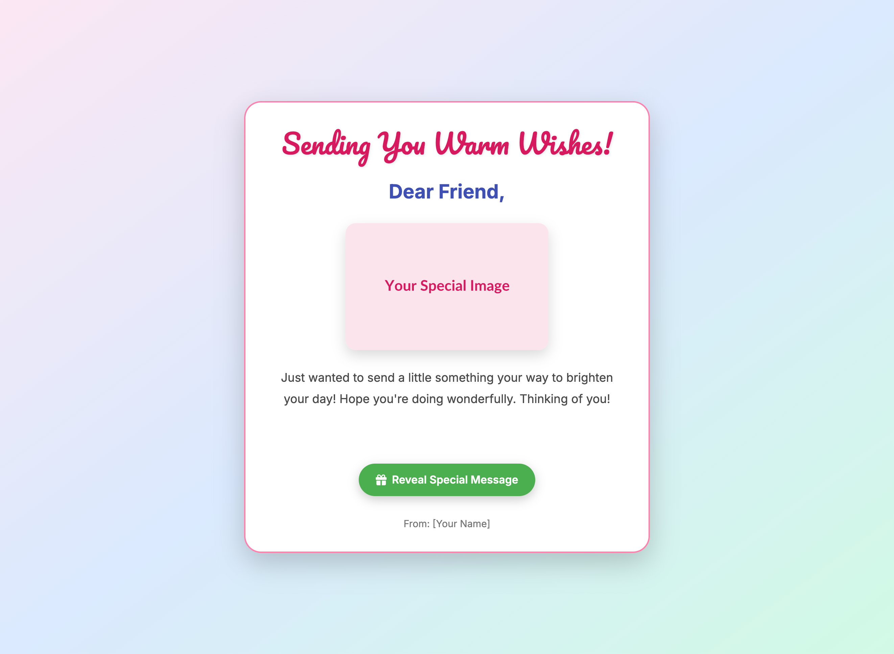

# My Personalized Digital Greeting Card

Welcome to your **Personalized Digital Greeting Card** project! This is a fun and simple way to get hands-on with HTML, CSS, and basic JavaScript. You'll learn how to customize a webpage to create a unique greeting card or invitation for anyone you like!

## 🚀 How to Get Started

1.  **Download the Code:**
    * Copy all the HTML, CSS, and JavaScript code into a single file named `index.html`.
2.  **Open in Browser:**
    * Double-click `index.html` to open it in your web browser.
    * You'll see a basic greeting card template.
3.  **Start Customizing!** Follow the "TODO" comments in the `index.html` file and the steps below.

## 🎨 Personalization Guide (TODO List)

Look for `<!-- TODO: ... -->` comments directly in the `index.html` file to find these customization points!

### Easy Customization:

* **1. Card Title:**
    * Change the `<title>` tag in the `<head>` section (around line 5). This text appears in the browser tab.
* **2. Header Message:**
    * In the `<h1 class="header-message">` (around line 115), change the main greeting (e.g., "Happy Birthday!", "Thank You!", "You're Invited!").
* **3. Recipient's Name:**
    * Change `Dear Friend,` in the `
` (around line 119) to the actual name of the person you're sending the card to.
* **4. Card Image:**
    * In the `` tag (around line 123), replace the `src` URL with a link to your own image. This could be a photo, a drawing, or any image that fits your card's theme.
    * *Tip:* You can use free image hosting sites, or just a local image file if you put it in the same folder as `index.html`.
* **5. Main Card Message:**
    * Rewrite the text inside the `
` (around line 133). Make it personal and heartfelt!
* **6. Hidden Message:**
    * Inside the `
` (around line 138), write a secret or extra message that will only appear when the button is clicked!
* **7. Action Button Text:**
    * Change the text inside the `<button id="revealButton">` (around line 144) (e.g., "Open Message", "Click Me!", "Your Surprise Awaits!").
* **8. Your Name:**
    * In the `
` (around line 150), put your name!

### Intermediate Customization (Challenge Yourself!):

* **1. Change Colors:**
    * Experiment with the `background` property of the `body` and `background-color` of `.card-container`, `.header-message`, `.recipient-name`, and `.hidden-message` in the `<style>` section.
    * Try different color gradients for the `body` to create a new mood.
* **2. Change Fonts:**
    * Explore [Google Fonts](https://fonts.google.com/) to find new fonts.
    * Update the `@import url(...)` in the `<style>` section and change `font-family` properties for `body`, `.header-message`, and other elements.
* **3. Add Music (Optional):**
    * In the `<script>` section (around line 200), there's commented-out code for a simple music player.
    * Uncomment it and replace `'https://www.soundhelix.com/examples/mp3/SoundHelix-Song-1.mp3'` with a link to a short, fun MP3 file.
    * Add a new button in your HTML (similar to the "Reveal Message" button) that calls the `playTune()` function when clicked.
* **4. Customize Confetti:**
    * In the `<style>` section, find the `.confetti` class and `@keyframes confetti-fall`.
    * Change the `background-color` of the confetti particles to your favorite colors!
    * Experiment with `width`, `height`, and animation properties for different confetti looks.

Have fun making a truly unique and special digital greeting card!