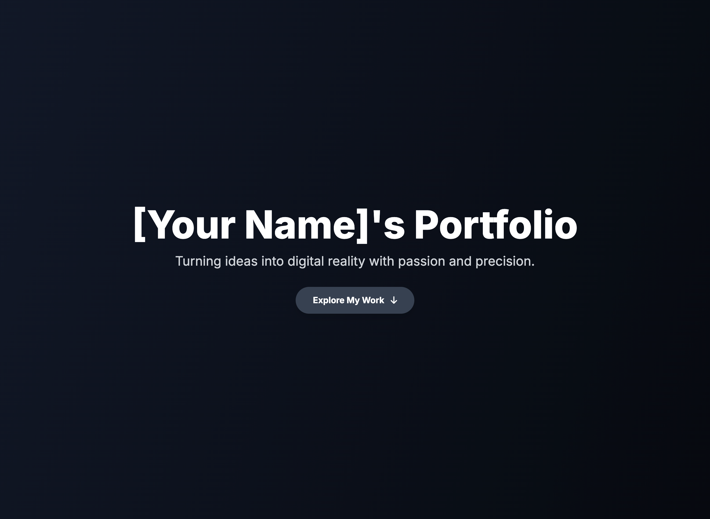

# My First Portfolio Website

Welcome to your personal portfolio website template\! This project helps you build a custom website using HTML, CSS (Tailwind CSS), and JavaScript. Showcase your skills, achievements, and personality with features like smooth scroll animations, interactive hover effects, and a responsive design.

Let's make it uniquely yours\!

## 🚀 How to Get Started

1.  **Download the Code:** Copy the HTML code into an `index.html` file on your computer.
2.  **Open in Browser:** Double-click `index.html` to see your website.
3.  **Start Customizing\!** Follow the "TODO" comments in the `index.html` file and the steps below.

## 🎨 Personalization Guide (TODO List)

### Beginner Level Customization

  * **1. Website Title:** Change the `<title>` in the `<head>` (e.g., `[Your Name]'s Awesome Portfolio`).
  * **2. Main Heading:** Update the `<h1>` in the Hero Section (e.g., `[Your Name]'s Portfolio`).
  * **3. Tagline:** Personalize the `<p>` tagline below the main heading.
  * **4. About Me Section:**
      * Change the heading `About Me` if desired.
      * Rewrite the paragraph to describe yourself, your interests, and what you're passionate about.
  * **5. My Skills Section:**
      * Update the `My Skills` heading.
      * **Edit Existing Skills:** Change `<h3>` for skill titles and `<p>` for descriptions.
      * **Change Icons:** Use icons from [Font Awesome Free Icons](https://fontawesome.com/v5/search?m=free) by updating the `<i>` class (e.g., `fas fa-camera`).
      * **Add More Skills:** Copy, paste, and customize skill `div` blocks.
  * **6. My Achievements Section:**
      * Update the `My Achievements` heading.
      * **Edit Existing Achievements:**
          * **Add Pictures:** Replace the `src` URL of the `` tag with your own image (screenshots, photos of projects, certificates, digital art). Use `https://placehold.co/600x350/YOUR_COLOR/YOUR_TEXT_COLOR?text=Your+Text` as a placeholder.
          * Change `<h3>` for achievement titles and `<p>` for descriptions.
      * **Add More Achievements:** Copy, paste, and customize achievement `div` blocks.
  * **7. Let's Connect\! Section:**
      * Change the `Let's Connect!` heading and descriptive paragraph.
      * **Email Link:** Update `href="mailto:your.email@example.com"` to your actual email.
      * **Social Media Links:** Replace `href="#"` with your LinkedIn, GitHub, Twitter (or other) profile URLs. Remove unused icons.
  * **8. Footer:** Customize the copyright text in the `<footer>` section.

### Bonus Intermediate Level (Challenge Yourself\!)

  * **1. Add a Button to Scroll to a Specific Section:**
      * In the `<header>` section, below "Explore My Work" button, add another `<a>` tag.
      * **Example Code:**
        ```html
        <a
            onclick="scrollToSection('contact')"
            class="bg-gray-600 hover:bg-gray-500 text-white font-bold py-3 px-8 rounded-full shadow-lg transform hover:scale-105 transition-all duration-300 ease-in-out cursor-pointer mt-4"
        >
            Contact Me <i class="fas fa-paper-plane ml-2"></i>
        </a>
        ```
      * Adjust `'contact'` to `'skills'` or `'achievements'` to scroll to other sections.
  * **2. Make a Favicon (Website Icon):**
      * Create a small image (`favicon.ico` or `favicon.png`) using an online favicon generator or your own design.
      * Add this line in the `<head>` section (around line 7):
        ```html
        <link rel="icon" href="path/to/your/favicon.ico" type="image/x-icon">
        ```
      * Update `href` to your favicon file's relative path.
  * **3. Deploy Your Website (Make it Publicly Accessible\!):**
      * Search for "free website hosting service" (e.g., GitHub Pages, Netlify, Vercel).
      * Generally involves creating an account, uploading your `index.html` and images, and following their deployment steps.

Have fun making your portfolio shine\! This is a fantastic step into the world of web development.