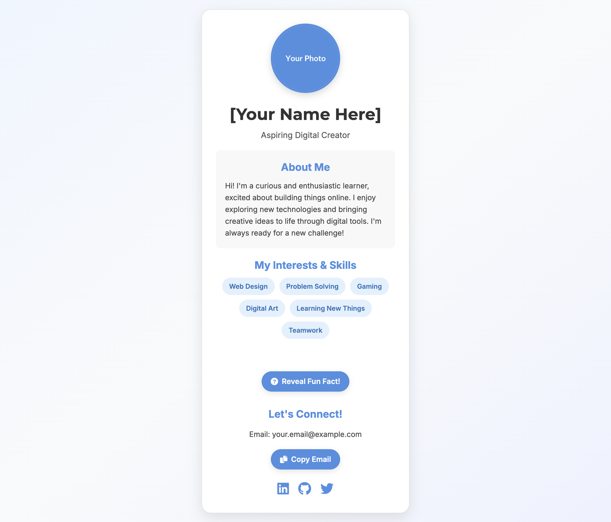

# Kartu Profil Digital Saya

Selamat datang di proyek **Kartu Profil Digital** Anda\! Ini adalah proyek tingkat pemula yang fantastis yang dirancang untuk membantu Anda membuat kehadiran online yang personal. Anda akan belajar cara menyusun konten dengan HTML, menatanya dengan indah menggunakan CSS (dengan Tailwind CSS), dan menambahkan interaktivitas sederhana dengan JavaScript.

Tujuan Anda adalah membuat kartu profil ini benar-benar mewakili DIRI ANDA\!

## 🚀 Cara Memulai

1.  **Unduh Kode:**
      * Salin semua kode HTML, CSS, dan JavaScript ke dalam satu file bernama `index.html`.
2.  **Buka di Peramban:**
      * Klik dua kali `index.html` untuk membukanya di peramban web Anda.
      * Anda akan melihat tata letak kartu profil dasar.
3.  **Mulai Kustomisasi\!** Ikuti komentar "TODO" di file `index.html` dan langkah-langkah di bawah ini.

## 🎨 Panduan Personalisasi (Daftar TODO)

Cari komentar `<!-- TODO: ... -->` langsung di file `index.html` untuk menemukan poin-poin kustomisasi ini\!

### Kustomisasi Mudah:

  * **1. Page Title:**
      * Ubah tag `<title>` di bagian `<head>` (sekitar baris 5). Teks ini muncul di tab peramban.
  * **2. Profile Picture:**
      * Di tag `` di dalam `profile-image-wrapper` (sekitar baris 125), ganti URL `src` dengan tautan ke foto profil Anda sendiri.
      * *Tips:* Anda bisa menggunakan situs hosting gambar gratis atau file gambar lokal jika Anda menempatkannya di folder yang sama dengan `index.html`.
  * **3. Your Name & Title:**
      * Ubah `<h1>` dengan `class="profile-name"` (sekitar baris 128) menjadi nama lengkap Anda.
      * Ubah `<p>` dengan `class="profile-title"` (sekitar baris 131) untuk menjelaskan diri Anda (misalnya, "Aspiring Coder," "Creative Designer," "Future Scientist").
  * **4. About Me Section:**
      * Tulis ulang paragraf di dalam `<div class="about-section">` (sekitar baris 139) untuk menceritakan sedikit tentang diri Anda, minat Anda, dan apa yang Anda nikmati.
  * **5. Interests & Skills:**
      * Di dalam `<div class="interests-list">` (sekitar baris 155):
          * **Edit yang Sudah Ada:** Ubah teks di dalam tag `<span class="interest-badge">` menjadi minat atau keterampilan Anda yang sebenarnya (misalnya, "Robotics," "Drawing," "Playing Guitar," "Learning Python").
          * **Tambah Lagi:** Salin dan tempel tag `<span>` yang sudah ada untuk menambahkan lebih banyak minat.
  * **6. Fun Fact:**
      * Di dalam `<div id="funFactSection">` (sekitar baris 169), tulis fakta menarik atau lucu tentang diri Anda yang akan terungkap saat tombol diklik\!
  * **7. Your Email:**
      * Di tag `<span id="myEmail">` (sekitar baris 180), ganti `your.email@example.com` dengan alamat email Anda yang sebenarnya. Tombol "Copy Email" kemudian akan menyalin email *Anda*\!
  * **8. Social Media Links:**
      * Di dalam `<div class="social-links">` (sekitar baris 186):
          * Ganti `href="#"` dengan URL asli profil media sosial Anda (misalnya, LinkedIn, GitHub, Twitter, atau lainnya).
          * Anda dapat menghapus blok `<a class="social-link">` yang tidak Anda perlukan, atau menambahkan lebih banyak dari Font Awesome (cari ikon "fab" seperti `fab fa-instagram`).

### Kustomisasi Tingkat Menengah (Tantang Diri Anda\!):

  * **1. Ubah Warna & Font:**
      * Eksperimen dengan properti `background-color` pada `body` dan `.profile-card-container` di bagian `<style>`.
      * Coba gradien warna yang berbeda untuk `body` (`background: linear-gradient(...)`) untuk menciptakan suasana baru.
      * Jelajahi [Google Fonts](https://fonts.google.com/) untuk gaya font baru dan perbarui `@import url(...)` serta properti `font-family`.
  * **2. Kustomisasi Interaksi:**
      * Tombol "Copy Email" dan "Reveal Fun Fact" sudah diatur. Bisakah Anda memikirkan interaksi sederhana lain untuk ditambahkan menggunakan JavaScript?
          * **Ide:** Tombol yang mengubah gambar di kartu, atau menampilkan kutipan yang berbeda.
  * **3. Favicon (Ikon Situs Web):**
      * Buat gambar kecil (`favicon.ico` atau `favicon.png`) menggunakan generator favicon online atau desain Anda sendiri.
      * Tambahkan baris ini di bagian `<head>` (sekitar baris 7):
        ```html
        <link rel="icon" href="path/to/your/favicon.ico" type="image/x-icon">
        ```
      * Perbarui `href` ke jalur relatif file favicon Anda.
  * **4. Sebarkan Situs Web Anda (Jadikan Publik\!):**
      * Setelah Anda puas dengan kartu Anda, cari "free website hosting service" (misalnya, GitHub Pages, Netlify, Vercel).
      * Ikuti instruksi mereka untuk mengunggah `index.html` dan gambar Anda agar kartu profil Anda dapat diakses secara online\!

Selamat bersenang-senang membuat kartu profil digital unik Anda\! Ini adalah langkah besar dalam menunjukkan kreativitas dan keterampilan Anda.

-----