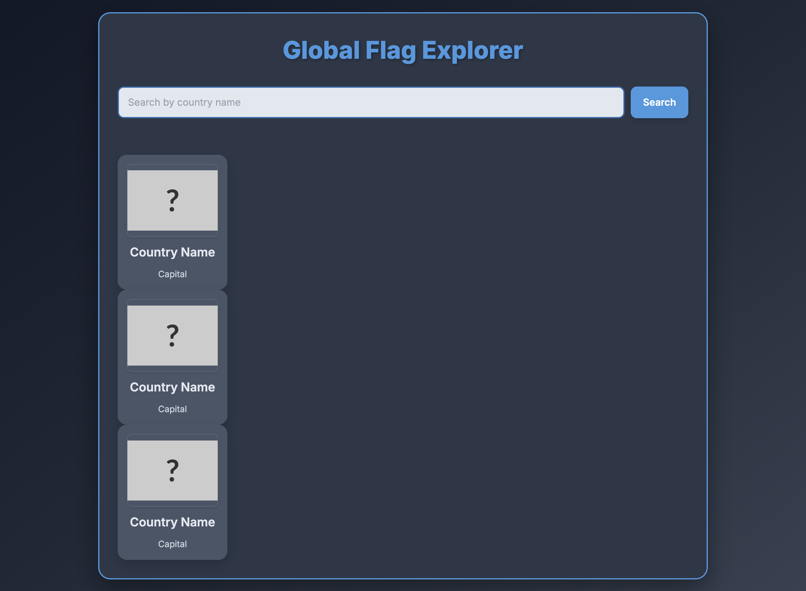
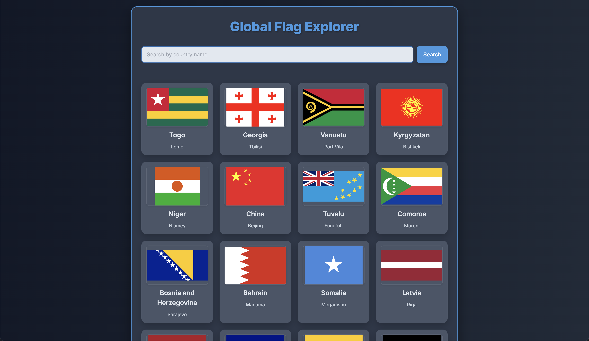

# Global Flag Explorer

Before:

After:

Welcome to the **Global Flag Explorer**! This project is designed as an intermediate-level challenge to help you practice consuming external APIs, handling asynchronous JavaScript, and customizing CSS layouts.

Your goal is to complete this flag viewer website, which currently has a basic structure but needs your coding skills to fetch and display country data from the `restcountries.com` API.

## 🚀 How to Get Started

1.  **Download the Code:**
    * Copy all the HTML, CSS, and JavaScript code into a single file named `index.html`.
2.  **Open in Browser:**
    * Double-click `index.html` to open it in your web browser.
    * You'll see a basic layout with a search bar and some placeholder cards.

## 💡 Your Coding Challenges (TODO List)

This project has several **`TODO`** comments in the JavaScript (`<script>` tag) and CSS (`<style>` tag) sections. These are your primary tasks!

### Essential Tasks to Make it Work:

1.  **Get Reference to Loading Message (JavaScript):**
    * In the `showLoading()` and `hideLoading()` functions, you'll need to make sure the `loadingMessage` paragraph is properly referenced and used to show/hide the loading text.
2.  **Implement Loading Indicators (JavaScript):**
    * Complete the `showLoading()` and `hideLoading()` functions to display/hide the "Loading country data..." message.
    * Call `showLoading()` at the beginning of `fetchAllCountries()`.
    * Call `hideLoading()` in the `finally` block of `fetchAllCountries()`.
3.  **Fetch All Country Data (JavaScript):**
    * In the `fetchAllCountries()` function: Uncomment the main `fetch` call and ensure the URL is correct (`https://restcountries.com/v3.1/all`).
    * Make sure to store the fetched data into the `allCountriesData` array and then call `displayFlags()` with this data.
4.  **Display Flags in the Grid (JavaScript):**
    * In the `displayFlags(countriesToShow)` function: Clear the `flagsGridContainer` first.
    * Loop through `countriesToShow` and use `createFlagCard()` for each country, then append the created card to the `flagsGridContainer`.
5.  **Implement Search Filter (JavaScript):**
    * In the `searchCountry()` function: Complete the filtering logic. You'll need to filter the `allCountriesData` array based on the `country.name.common` or `country.capital` matching the search query.
    * Call `displayFlags()` with the filtered results.
6.  **Call Initial Fetch on Page Load (JavaScript):**
    * At the very end of the `<script>` tag: Add a `window.onload` event listener and call `fetchAllCountries()` inside it to load the flags when the page first loads.

### Design & Feature Enhancements:

1.  **Grid Layout (CSS):**
    * In the `<style>` tag, find the CSS rules for `#flagsGridContainer`.
    * **Challenge:** Uncomment and adjust `display: grid;` (or `display: flex;`) and related properties like `grid-template-columns`, `gap`, `flex-wrap`, `justify-content` to create a responsive grid layout (e.g., 4 columns on desktop).
2.  **Customize Card Appearance (CSS):**
    * Experiment with the `width` and `height` properties for `img` within `.flag-card` and the overall `width` of `.flag-card` itself to make them look uniform and appealing in your chosen layout.
    * Explore adding more styling, such as subtle borders, shadows, or different background colors on hover.
3.  **Enhance Flag Card Details:**
    * **Challenge:** Modify the `createFlagCard(country)` function to display more information about each country on the card, such as its population, region, or currency. You'll need to research the `restcountries.com` API response structure to find these details.

Have fun building your Global Flag Explorer! This project will significantly boost your understanding of how web applications interact with external data.