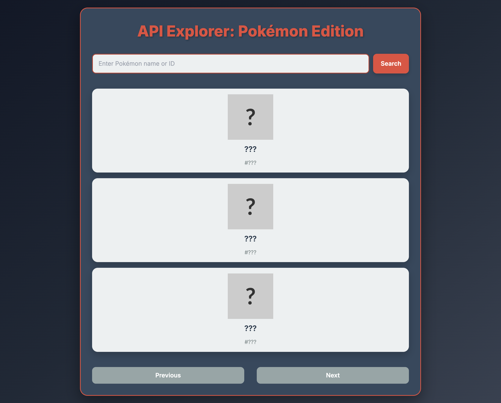
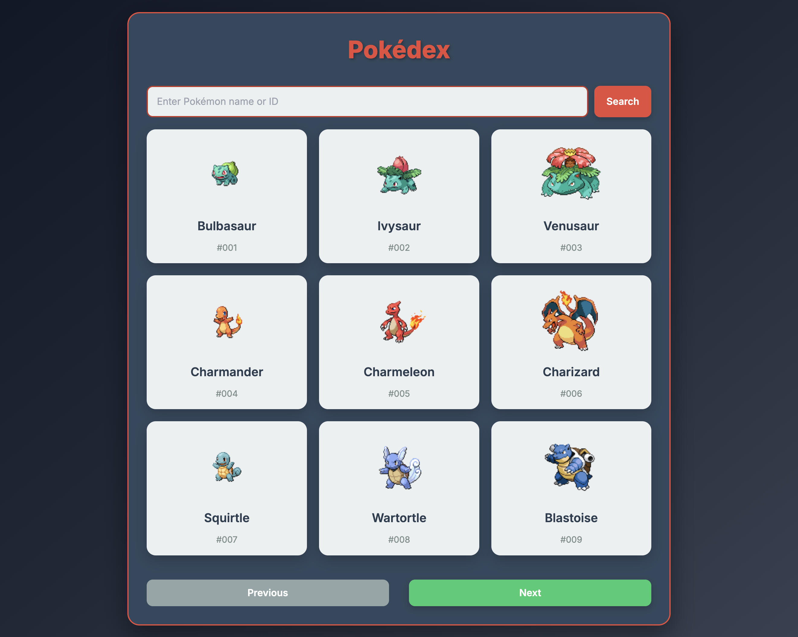

# API Explorer: Pokémon Edition

Before:

After:

Welcome to the **API Explorer: Pokémon Edition**\! This project is designed as an intermediate-level challenge to help you practice consuming external APIs, handling asynchronous JavaScript, and customizing CSS layouts.

Your goal is to complete this Pokedex-style website, which currently has a basic structure but needs your coding skills to fetch and display Pokémon data from the PokeAPI.

## 🚀 How to Get Started

1.  **Download the Code:**
      * Copy all the HTML, CSS, and JavaScript code into a single file named `index.html`.
2.  **Open in Browser:**
      * Double-click `index.html` to open it in your web browser.
      * You'll see a basic layout with a search bar and some placeholder cards.

## 💡 Your Coding Challenges (TODO List)

This project has several **`TODO`** comments in the JavaScript (`<script>` tag) and CSS (`<style>` tag) sections. These are your primary tasks\!

### Essential Tasks to Make it Work:

1.  **Uncomment and Use the PokeAPI URL (JavaScript):**
      * In the `fetchAndDisplayPokemonGrid(offset)` function: Find the commented `fetch` call and uncomment it. This is where you'll connect to the PokeAPI to get a list of Pokémon.
      * In the `fetchPokemonDetails(query)` function: Find the commented `fetch` call and uncomment it. This is for fetching details of a single Pokémon.
      * **Hint:** The base URL for PokeAPI is `https://pokeapi.co/api/v2/`.
2.  **Fetch Individual Pokémon Details for the Grid (JavaScript):**
      * Inside `fetchAndDisplayPokemonGrid(offset)`: After fetching the list of Pokémon, you'll need to loop through `listData.results` and make *another* `fetch` call for each Pokémon's `url` property to get their full details (like images, types, and stats).
      * Use `Promise.all()` to wait for all these detail fetches to complete efficiently.
      * Call `createPokemonGridCard(pokemon)` for each fetched Pokémon to display it.
3.  **Implement Initial Load (JavaScript):**
      * At the very end of the `<script>` tag: Add a `window.onload` event listener. Inside it, call `fetchAndDisplayPokemonGrid(currentOffset)` to load the first set of Pokémon when the page loads.
4.  **Implement Loading Indicators (JavaScript):**
      * Complete the `showLoading()` and `hideLoading()` functions to display/hide the "Loading Pokémon data..." message (`loadingMessage` paragraph).
      * Call `showLoading()` at the beginning of `fetchAndDisplayPokemonGrid` and `fetchPokemonDetails`.
      * Call `hideLoading()` in the `finally` block of both fetch functions.
5.  **Enable Navigation Buttons (JavaScript):**
      * Complete the `prevButton` and `nextButton` event listeners. They should update `currentOffset` and then call `fetchAndDisplayPokemonGrid()` again.
      * Implement logic to disable the `nextButton` when there are no more Pokémon to load (e.g., if `listData.results.length` is less than `POKEMONS_PER_PAGE`).

### Design & Feature Enhancements:

1.  **Grid Layout (CSS):**
      * In the `<style>` tag, find the CSS rules for `#pokemonGridContainer`.
      * **Challenge:** Uncomment `display: grid;` and `grid-template-columns`, then adjust `grid-template-columns` to create a responsive 3x3 grid (e.g., using `repeat(auto-fit, minmax(180px, 1fr))`). Add `gap` for spacing.
2.  **Customize Card Appearance (CSS):**
      * Experiment with the `width` and `min-height` for `.pokemon-grid-card` to match your desired grid layout.
      * Explore adding borders, more padding, or different shadows to `pokemon-grid-card`.
3.  **Enhance Single Pokémon Display (`#pokemonDisplay`) (CSS & HTML):**
      * When you search for a Pokémon, the `#pokemonDisplay` section becomes visible. Its current styling is basic.
      * **Challenge:** Improve the layout of the types, abilities, and stats. Maybe use more visual elements, or adjust font sizes and colors.
      * **Hint:** The `type-badge` classes are already styled with colors, but you could expand the type colors in CSS or modify how they are displayed.
4.  **Explore More Data:**
      * The `displaySinglePokemon` function already processes types, abilities, and stats. Explore the PokeAPI documentation to find other interesting data points (e.g., weight, height, sprites for different views) and add them to the single Pokémon display.
5.  **User Experience Improvements:**
      * Add visual feedback when the search input is focused.
      * Implement a "Clear Search" button to return to the grid view from a single Pokémon display.
      * Add a global back-to-grid button.

Have fun building your API Explorer\! This project will significantly boost your understanding of how web applications interact with external data.

-----